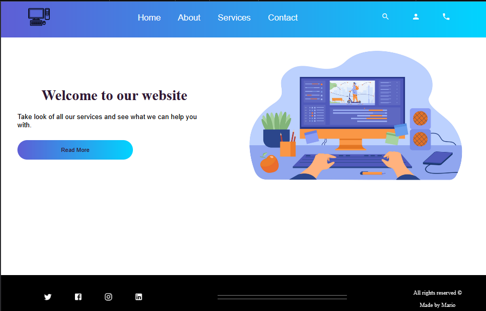

# Mini-online-shop

---

## :astonished: De que trata?

## En sitio web orientado a dar servicios de desarrollo web conformado por distintas secciones para que el usuario pueda navegar libremente y sea accesible para el.

###

### imágenes del resultado final:

---

## :interrobang: En que se mejoro?

1. ### Crear diversas rutas y reutilización de componentes
2. ### Como renderizar más facilmente los elementos vinculandolos con los componentes
3. ### Usar menos consultas de medios para lograr una buena adaptación a todos los dispositivos.
4. ### Utilizar flex, em, rem y gradients.
5. ### comprender el funcionamiento de los props

---

## Link del proyecto:

## https://melomario57.github.io/web-page/

## Tecnologías principales utilizadas:

&nbsp;
&nbsp;
